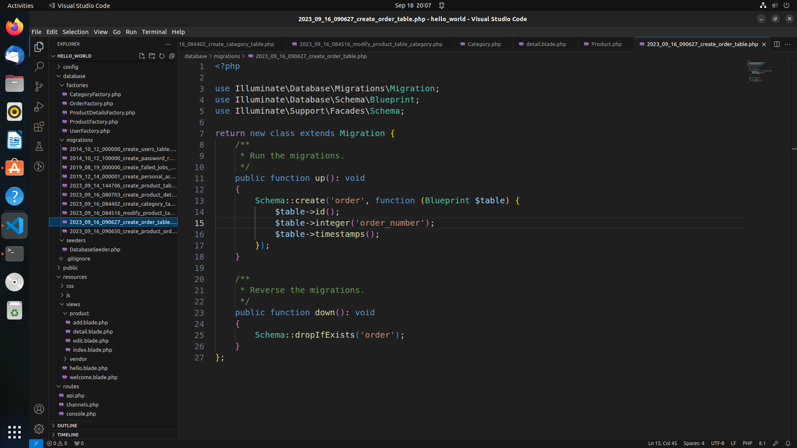
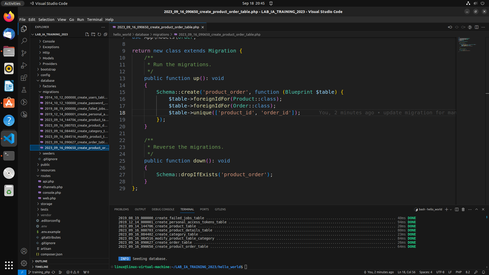
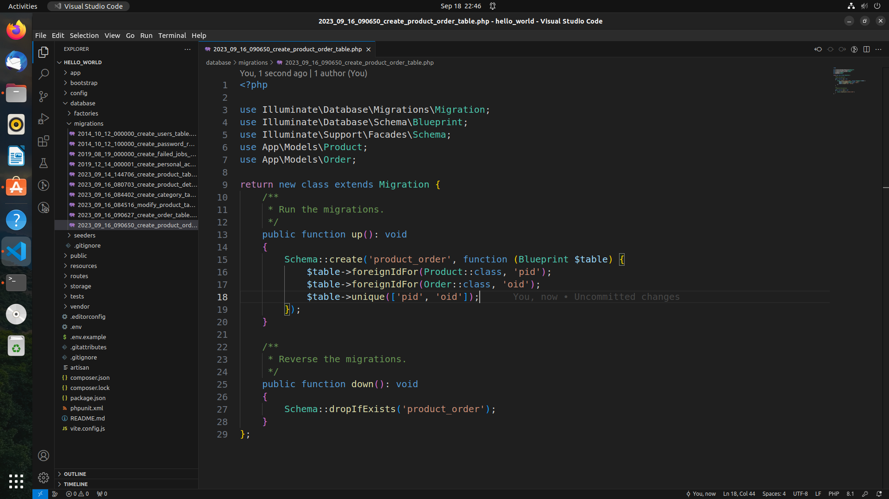
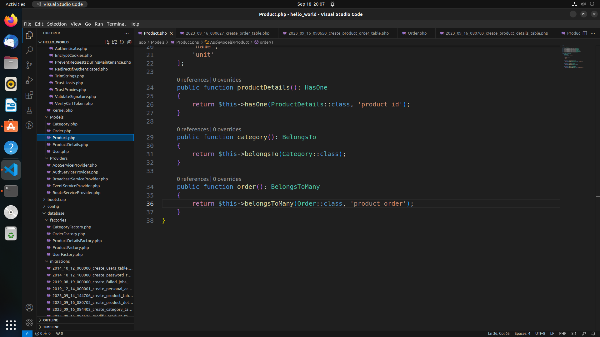
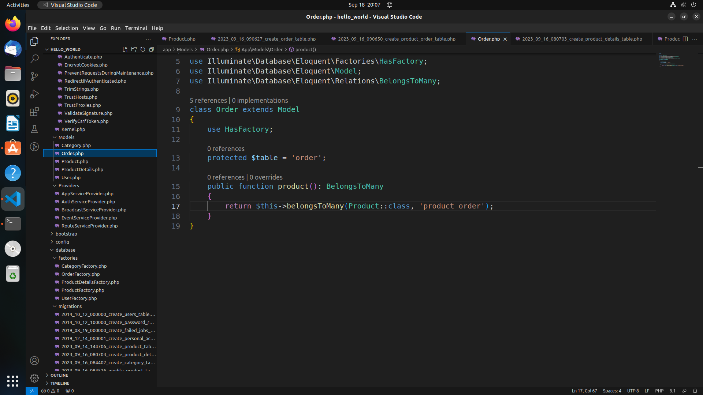
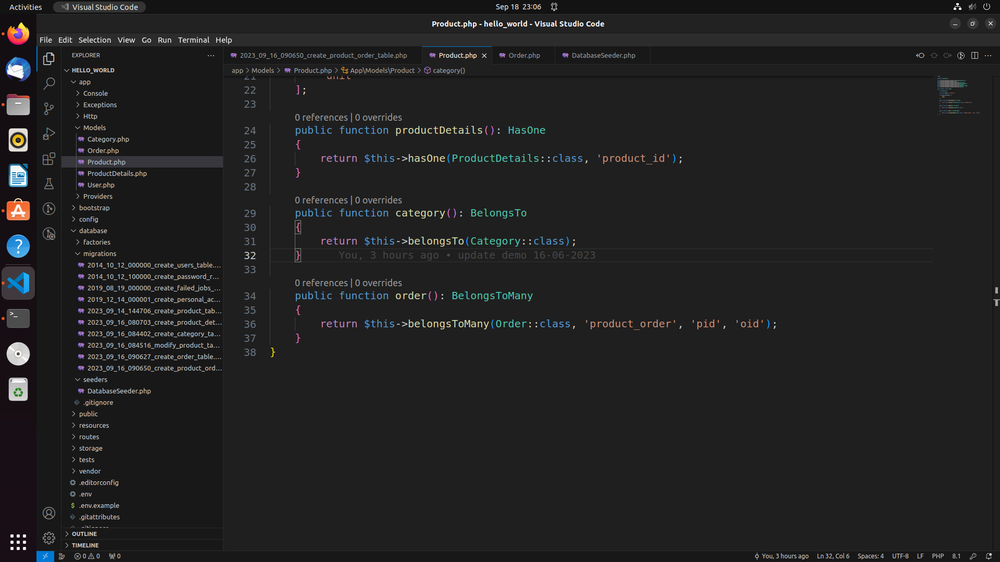
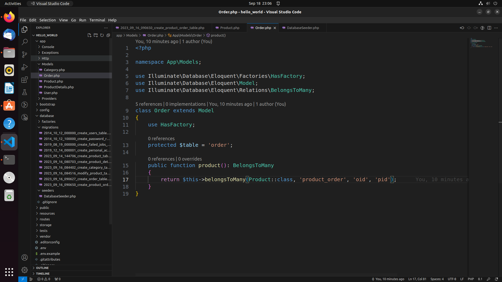
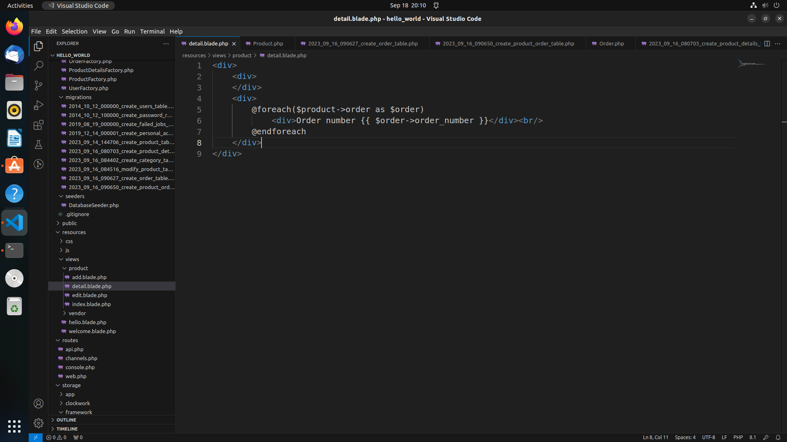
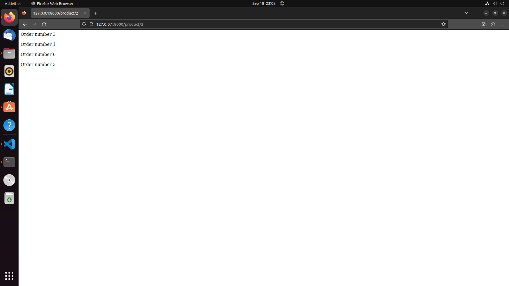

# Many-to-many mapping
This is guide to help you set up many-to-many mapping for this project. Vietnamese translation will be in the bracket in the same paragraph.  
(Đây là hướng dẫn để các bạn có thể tạo được liên kết nhiều-nhiều trong database cho project này.)
## Requirements (Yêu cầu)
- Have 'product' table (Có bảng 'products')
## Database structure (Cấu trúc dữ liệu)
We will use 'order' table to connect many-to-many in database. And if you know about many-to-many structure, you will know that many-to-many will use a pivot table, so we will create a pivot table called 'product_order' to fulfill that. (Chúng ta sẽ sử dụng bảng 'order' để tạo cấu trúc nhiều-nhiều. Nếu các bạn đã biết về cấu trúc này, thì chúng ta cần 1 bảng trung gian thì mới thiết lập được mối quan hệ nhiều nhiều này, vì thế nên chúng ta sẽ tạo thêm 1 bảng trung gian là 'product_order' để kết nối 2 bảng này với nhau, tạo thành mối quan hệ nhiều-nhiều.)
Table structure is as picture below(Cấu trúc bảng như hình dưới):  

## Steps (Các bước thực hiện)
- Step 1: Create migration for 'order' table by using this command in terminal (Tạo 1 migration cho bảng 'order' dùng lệnh trong terminal như dưới):  
```shell
php artisan make:migration --create=order
```
After enter this command, name it whatever you like (I name it as create_order_table) (Ta đặt tên cho migration như nào cũng được, mình đạt tên nó là 'create_order_table')
Modify the content of thí migration like this (Thay đổi nội dung của file migration như sau):

- Step 2: Create migration for 'product_order' table by using this command in terminal (Tạo 1 migration cho bảng 'product_order' dùng lệnh trong terminal như dưới):
```shell
php artisan make:migration --create=product_order
```
After enter this command, name it whatever you like (I name it as create_product_order_table) (Ta đặt tên cho migration như nào cũng được, mình đạt tên nó là 'create_product_order_table')
Modify the content of thí migration like this (Thay dổi nội dung của file migration như sau):

Notice (Chú ý): If the unique key is different from default, please change key name in unique() array to same as key define above like in the image below (Nếu tên khóa chính khác với mặc định thì phải thay đổi sao cho mảng trong hàm unique() giống với tên khóa chính được đặt ở trên như hình): 

- Step 3: Set up in 'product' and 'order' model (Thiết lập cho mô hình 'product' và 'order')
Use this command in terminal to create 'Order' model if not exists yet (Dùng lệnh này để tạo model 'Order' nếu model chưa tồn tại):
```shell
php artisan make:model Order
```
Change model 'Product' and model 'Order' like images below (Thay đổi mô hình 'Product' và mô hình 'Order' như hình dưới):


Notice (Chú ý): If pivot table have different foreign key from default, change the foreign key name in model according to key name in pivot table like images below (Nếu bảng trung gian có các khóa phụ với tên khác tên mặc định, thì các bạn phải thay đổi tên khóa phụ trong mô hình cho đúng với tên khóa trong bảng trung gian, như hình dưới):


## Usage (Cách sử dụng)
Fetch the items in model like fetching in array of items (Lấy các dữ liệu liên quan như lấy ra các dữ liệu trong 1 mảng):


